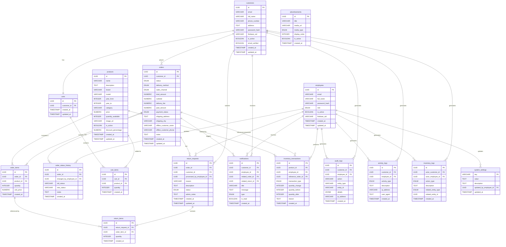

```mermaid
erDiagram
    customers {
        UUID id PK
        VARCHAR email
        VARCHAR full_name
        VARCHAR phone_number
        TEXT address
        VARCHAR password_hash
        VARCHAR firebase_uid
        BOOLEAN is_active
        BOOLEAN email_verified
        TIMESTAMP created_at
        TIMESTAMP updated_at
    }

    employees {
        UUID id PK
        VARCHAR email
        VARCHAR full_name
        VARCHAR password_hash
        ENUM role
        BOOLEAN is_active
        VARCHAR firebase_uid
        TIMESTAMP created_at
        TIMESTAMP updated_at
    }

    products {
        UUID id PK
        VARCHAR name
        TEXT description
        VARCHAR brand
        VARCHAR model
        INTEGER year_from
        INTEGER year_to
        VARCHAR category
        NUMERIC price
        INTEGER quantity_available
        VARCHAR image_url
        BOOLEAN is_active
        NUMERIC discount_percentage
        TIMESTAMP created_at
        TIMESTAMP updated_at
    }

    orders {
        UUID id PK
        UUID customer_id FK
        ENUM status
        ENUM delivery_method
        ENUM sales_channel
        NUMERIC total_amount
        NUMERIC subtotal
        NUMERIC delivery_fee
        NUMERIC paid_amount
        ENUM payment_status
        TEXT shipping_address
        VARCHAR shipping_city
        VARCHAR offline_customer_name
        VARCHAR offline_customer_phone
        TEXT notes
        TIMESTAMP created_at
        TIMESTAMP updated_at
    }

    order_items {
        UUID id PK
        UUID order_id FK
        UUID product_id FK
        INTEGER quantity
        NUMERIC unit_price
        TIMESTAMP created_at
    }

    order_status_history {
        UUID id PK
        UUID order_id FK
        UUID changed_by_employee_id FK
        VARCHAR old_status
        VARCHAR new_status
        TEXT notes
        TIMESTAMP created_at
    }

    carts {
        UUID id PK
        UUID customer_id FK
        TIMESTAMP created_at
        TIMESTAMP updated_at
    }

    cart_items {
        UUID id PK
        UUID cart_id FK
        UUID product_id FK
        INTEGER quantity
        TIMESTAMP created_at
    }

    return_requests {
        UUID id PK
        UUID order_id FK
        UUID customer_id FK
        UUID processed_by_employee_id FK
        VARCHAR reason
        TEXT description
        ENUM status
        TEXT admin_notes
        TIMESTAMP created_at
        TIMESTAMP updated_at
    }

    return_items {
        UUID id PK
        UUID return_request_id FK
        UUID order_item_id FK
        INTEGER quantity
        TIMESTAMP created_at
    }

    notifications {
        UUID id PK
        UUID customer_id FK
        UUID employee_id FK
        UUID related_order_id FK
        UUID related_return_id FK
        VARCHAR title
        TEXT message
        ENUM type
        BOOLEAN is_read
        TIMESTAMP created_at
    }

    inventory_transactions {
        UUID id PK
        UUID product_id FK
        UUID employee_id FK
        UUID reference_order_id FK
        ENUM transaction_type
        INTEGER quantity_change
        INTEGER quantity_before
        INTEGER quantity_after
        TEXT reason
        TIMESTAMP created_at
    }

    audit_logs {
        UUID id PK
        UUID customer_id FK
        UUID employee_id FK
        VARCHAR action
        VARCHAR entity_type
        VARCHAR entity_id
        JSONB details
        VARCHAR ip_address
        TIMESTAMP created_at
    }

    activity_logs {
        UUID id PK
        UUID customer_id FK
        UUID employee_id FK
        ENUM activity_type
        TEXT description
        VARCHAR ip_address
        TEXT user_agent
        TIMESTAMP created_at
    }

    inventory_logs {
        UUID id PK
        UUID actor_customer_id FK
        UUID actor_employee_id FK
        ENUM action_type
        TEXT description
        ENUM related_entity_type
        UUID related_entity_id
        TIMESTAMP created_at
    }

    advertisements {
        UUID id PK
        VARCHAR title
        VARCHAR media_url
        ENUM media_type
        INTEGER display_order
        BOOLEAN is_active
        TIMESTAMP created_at
    }

    system_settings {
        VARCHAR key PK
        TEXT value
        TEXT description
        UUID updated_by_employee_id FK
        TIMESTAMP updated_at
    }

    customers ||--o{ orders : "places"
    customers ||--|| carts : "has"
    customers ||--o{ return_requests : "submits"
    customers ||--o{ notifications : "receives"
    customers ||--o{ audit_logs : "generates"
    customers ||--o{ activity_logs : "generates"
    customers ||--o{ inventory_logs : "generates"

    employees ||--o{ order_status_history : "updates"
    employees ||--o{ return_requests : "processes"
    employees ||--o{ notifications : "receives"
    employees ||--o{ inventory_transactions : "performs"
    employees ||--o{ audit_logs : "generates"
    employees ||--o{ activity_logs : "generates"
    employees ||--o{ inventory_logs : "generates"
    employees ||--o{ system_settings : "updates"

    orders ||--|{ order_items : "contains"
    orders ||--o{ order_status_history : "has"
    orders ||--o{ return_requests : "has"
    orders ||--o{ notifications : "triggers"
    orders ||--o{ inventory_transactions : "references"

    products ||--|{ order_items : "included in"
    products ||--|{ cart_items : "added to"
    products ||--|{ inventory_transactions : "tracked by"

    carts ||--|{ cart_items : "contains"

    return_requests ||--|{ return_items : "contains"

    order_items ||--o{ return_items : "referenced by"
```
